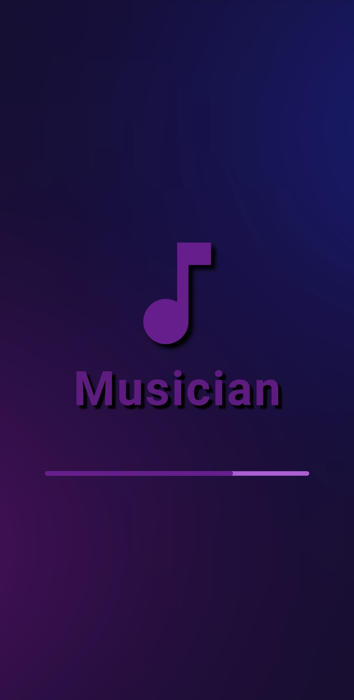
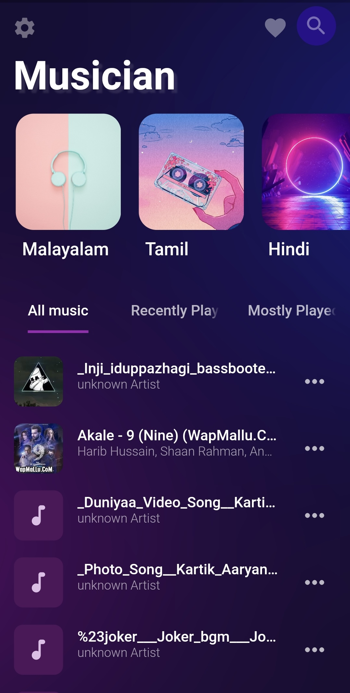
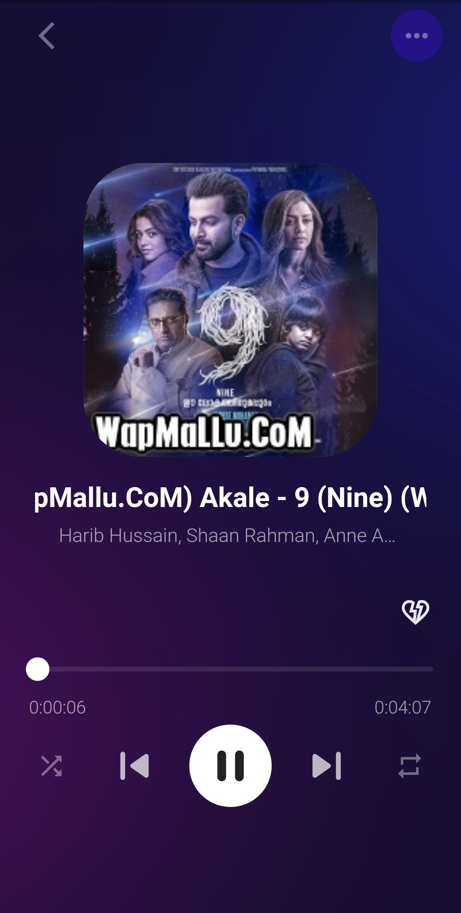
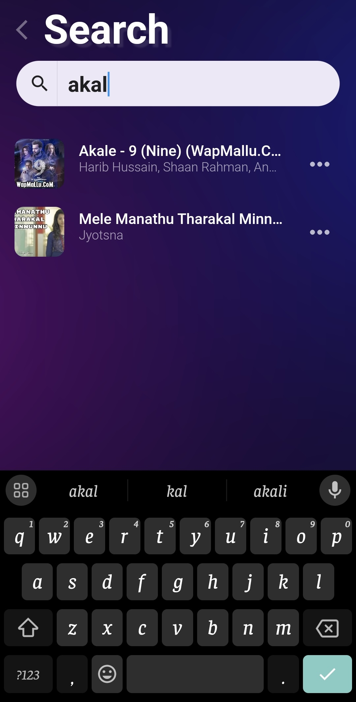
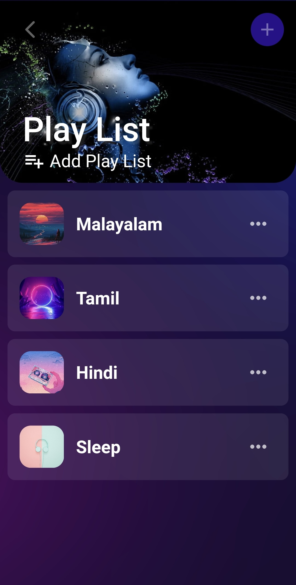
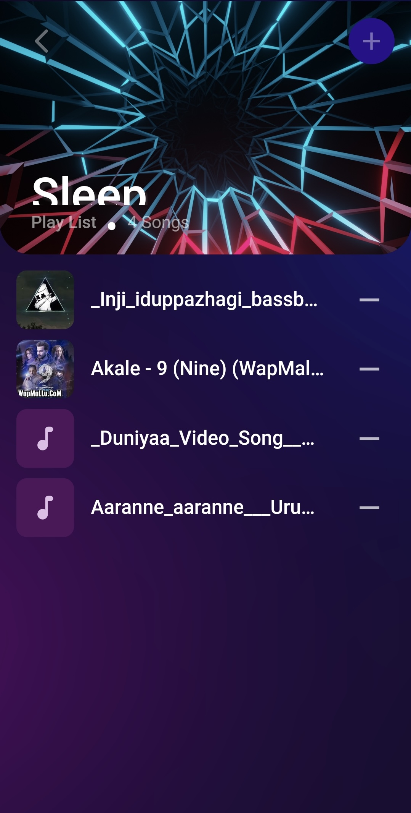

# Musician

This application is a Music Player appliction using Flutter, optimized for Android devices, providing a responsive seamless experience on the platform. Implemented data retrieval from local storage, allowing user to access and manage their music library directly within the application.

> Warning: Musician still in development, constantly being optimized and isn't still stable enough to be used in production environments.

## The Aim

The Musician is provide users to seamless and enjoyable listening experience. It aims to organize and play music efficiently, allowing users to easily navigate through their music library. Additionally, the Musician strives to offer features such as customizable playlist, high-quality audio playback, and intuitive user interfaces to enhance the overall music listening experience.

## Technologies Used

- flutter.
- dart.
- hive.
- on_audio_query.
- just_audio.
- just_auio_background.
- provider.

## Features

- seamless audio playback.
- organized music library.
- custamizable playlists.
- shuffle and repeat options.
- quick access to recently played tracks.
- background playback while using other apps.
- offline playback.

## Deploy

- [View On Amazon App Store](https://www.amazon.com/gp/product/B0CLYBXBKX)

## Screenshots

 
 
 

## Contributing

Thank you for considering contributing to Musician.

## License

Musician is an open-source software application licensed under the [Privacy Policy Generator](https://www.freeprivacypolicy.com/live/d16abe81-6b84-4af9-a639-86df5af82aca)

